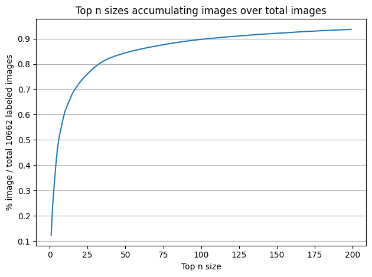

# HyperKvasir: Exploratory Data Analysis
**General:** 

gastrointestinal tract image dataset : 110,079 images and 373 videos where it captures anatomical landmarks and pathological and normal findings. The results is more than 1,1 million images and video frames all together.

## Labeled images

- 10,662 labeled images JPEG format.
- 23 different classes. number of images per class are imbalanced
- **Imbalance classes**
    
    
    
- **Image sizes**
    - Varying - 751 different sizes / 10662 images
        
        
        
    - Number of top n sizes vs %total images
        
        
        
- Visualization each class and corresponding images
    
    
    

## Unlabeled images

99,417 unlabeled images

## Segmented images

1,000 images from the polyp class (original - mask - bounding box)

- segmentation mask: ROI = the pixels depicting polyp tissue = (white mask), others in black.
- bounding box: outermost pixels of the found polyp.

## Annotated video

 373 videos (different findings and landmarks) approximately 11.62 hours of videos and 1,059,519 video frames

that can be converted to images if needed. Each video has been manually assessed by a medical professional working in the field of gastroenterology and resulted in a total of 171 annotated findings.